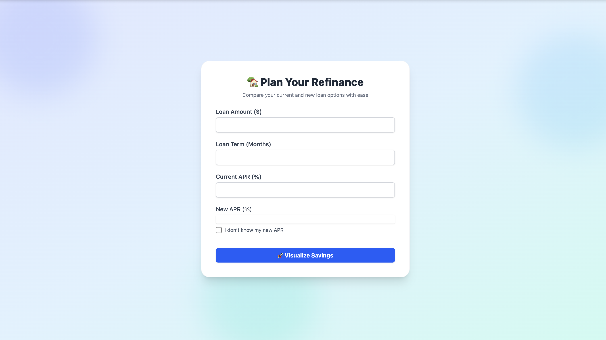
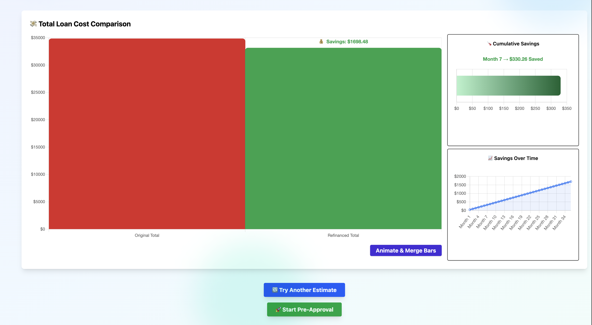
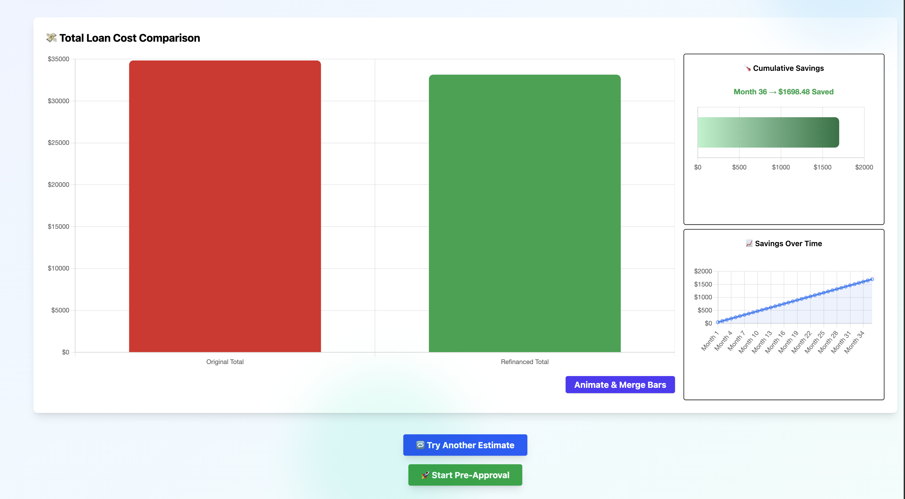

# 💸 ReFiViz – Refinance Benefit Visualizer

**RefiViz** is a full-stack Ruby on Rails application designed to help users visualize their auto loan refinancing benefits. It provides an intuitive form to enter loan details and instantly generates interactive savings graphs using Chart.js and Hotwire Stimulus.

This project was built to demonstrate full-stack engineering skills tailored to Caribou’s tech stack — especially their migration from React to Hotwire Stimulus within a Rails monolith. It also introduces new UX ideas like an animated "savings thermometer" for showcasing monthly cumulative savings.

---

## 🔥 Demo

[View Here...](https://youtu.be/2Z9kg8TkqgY)

---

## ✨ Features

- 🎯 **Loan Calculator**: Enter loan amount, term, and APRs to calculate savings.
- 📊 **Bar Chart Comparison**: Compare original vs refinanced loan cost with animated bars.
- 🌡️ **Savings Thermometer**: Dynamic, animated horizontal bar that loops to show cumulative savings monthly.
- 📈 **Savings Over Time**: Line chart visualizing total monthly savings growth.
- 🧠 **Smart APR Input**: Toggle slider to estimate APR based on credit score if unknown.
- 💫 **Animations**: Visual cues to emphasize savings benefits using Chart.js transitions and easing.
- ✅ **Fully Responsive**: TailwindCSS ensures a seamless experience on all screen sizes.

---

## 🛠️ Built With

- **Ruby on Rails 7.1**
- **Hotwire (Turbo + Stimulus)**
- **TailwindCSS**
- **Chart.js**
- **PostgreSQL**
- **ERB views** (no React)

---

## 📸 Screenshots

### Overview and Refinance Summary



### Merged Bar Chart


### Yearly, Monthly and Savings over the time Charts


---

## 🚀 Getting Started

To run this app locally:

```bash
git clone https://github.com/VidhyaSree-N/ReFi_Viz.git
cd ReFi_Viz

bundle install
yarn install --check-files

rails db:create db:migrate
bin/dev

Then open http://localhost:3000 in your browser.
```


## 🧠 Inspiration

This app was built as a customized showcase for the **Full Stack Software Engineer role at Caribou**, reflecting:

- 🚘 Caribou’s mission to reduce auto loan expenses.
- 🏗️ Their full-stack **Ruby on Rails monolith architecture**.
- 🔁 Migration from **React to Hotwire Stimulus**.
- 💡 Emphasis on clean, high-quality, customer-facing UX.

---

## 📚 Future Enhancements

- 📤 Save and share results
- 🧪 Add RSpec system tests
- 🔄 Currency/unit formatting for international use
- 📱 Mobile-first layout optimization

---

## 👩‍💻 Author

**Vidhya Sree**  
[GitHub](https://github.com/VidhyaSree-N) • [LinkedIn](https://www.linkedin.com/in/vidhya-sree-n/)

---

## 📄 License

This project is licensed under the [MIT License](LICENSE) — feel free to fork, learn, and build upon it!
